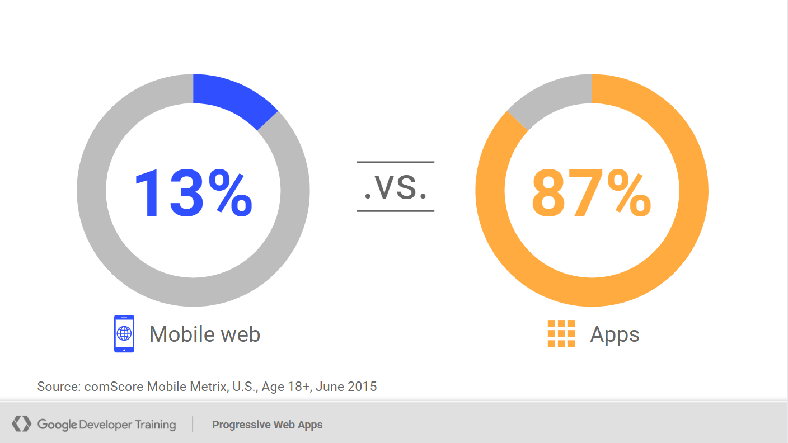
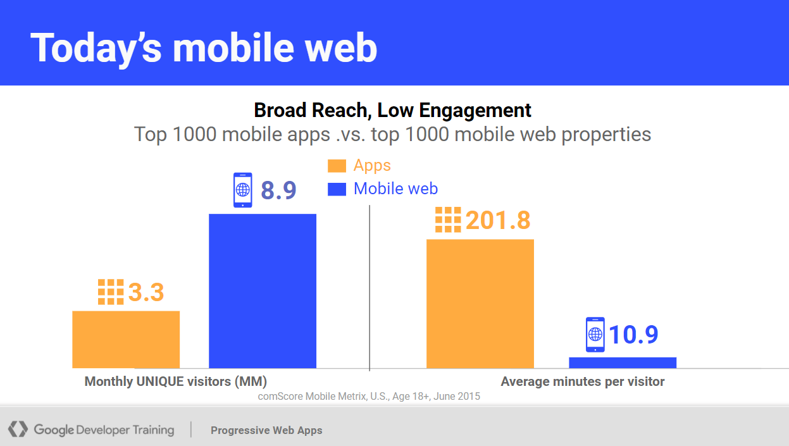
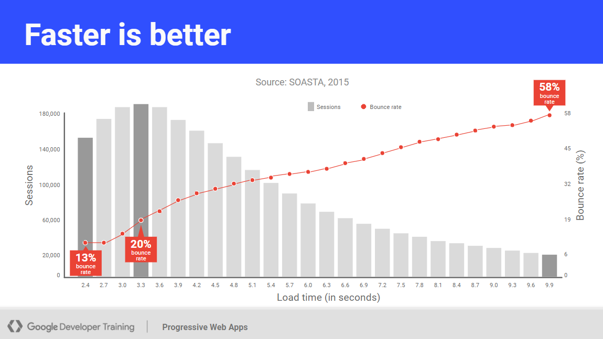

# [PWA] Progressive Web Apps 渐进式网页应用入门

## PWA简介

渐进式网页应用(简称PWA)是一种Web应用标准。
通过使用一系列新兴技术让你的Web应用**快速，安全，可安装，可离线使用，可适配各种设备**，使其拥有不亚于原生应用的使用体验。
主要技术包括`App Manifest`, `Service Worker`, `Web Push`等

PWA最早由Google于2015年发起，同年Chrome支持`Service Worker`。
之后，Safari和Edge也相继在2018年和2019年提供支持。

## 为什么需要PWA

随着十多年来智能手机的发展和普及，人们访问互联网的方式已经改变，移动互联网的使用率已超过传统互联网。
数据显示，终端用户有87%的时间花费在手机应用上，相对的，网页只占到不足二成。

手机原生应用固然好用，但是也天生带有缺陷：

- 不同平台需要多次实现，例如Android和IOS
- 内容封闭，无法被搜索引擎检索到
- 应用分发成本高，用户需要下载几十上百MB的安装包

而这些缺点正是Web应用的优点，可以说Web就是为此而生。
但是，Web也有自己的缺点

- 加载速度慢
- 离线无法使用
- 没有快捷入口
- 没有消息推送

这些缺点使得Web虽然便捷好用，但是用户体验始终不如原生应用，用户粘性差。

面对Native和Web

- 很多公司为了兼顾两者的优缺点，不得不Android+IOS+Web三路并进，成本骤升3倍 (例如知乎)
- 还有一些公司，为了减少成本，获得灵活性，在原生应用中嵌入Web页面，又给用户体验带来了巨大的落差 (例如饿了么)

那么如果我们能够克服Web的这些缺点，是否就可以获得媲美原生应用的体验了呢？

答案当然就是PWA。PWA使得Web应用更受用户喜爱。
一个直观的例子时，在推出PWA应用后：

- Twitter，会话页面数+65%，推文数+75%，跳出率-20%，应用程序大小-97%
- Nikkei，流量+230%，订阅量+58%，活跃用户+59%
- Hulu，访问量+27%

## PWA Checklist

PWA通过一系列指导意见帮助我们设计Web应用，并提供相应的技术支持。

以下两个清单分别为Core和Optimal

- 如果满足了Core List，则你的应用可以称之为PWA。
- 如果同时还满足了Optimal List，那么恭喜你创建了一个一流的PWA。

### Core

**快速**

速度是至关重要的指标，与用户粘性息息相关。其中尤为重要的是首屏显示速度。

**响应式布局**

用户可以在任意尺寸的屏幕上进行访问。

**可离线响应**

在离线状态下，显示应用页面而非浏览器的空白页。

**可安装**

可以将应用安装到本地环境。这将使得用户可以更加便捷地与应用互动。

### Optimal

**可离线使用**

在离线状态下，对于非网络相关的功能，依然能够正常使用。

**可通过搜索发现**

应用内容可以被搜索引擎发现并正确索引。

**适配任何输入设备**

主要包括鼠标，键盘和触摸屏。

**需要时请求权限**

当需要使用额外权限时，询问用户。(例如GPS，通知)

**完全可访问**

满足[WCAG 2.0](https://www.w3.org/TR/WCAG20/)可访问性要求

## PWA技术

PWA是一种标准而不是不是一项技术，但是一些PWA标准技术可以帮助我们快速构建一个PWA应用。

### Web Manifest

[Web Manifest](https://developer.mozilla.org/en-US/docs/Web/Manifest)

### Service Worker

### WorkBox

## 例子

## Reference

- https://developers.google.com/web/ilt/pwa/why-build-pwa
- https://web.dev/what-are-pwas/
- https://web.dev/pwa-checklist/
- https://developer.mozilla.org/zh-CN/docs/Web/Progressive_web_apps
